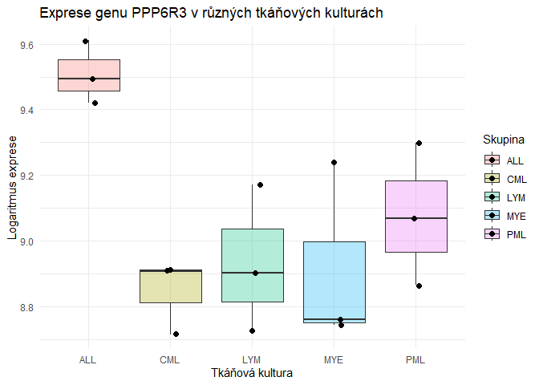
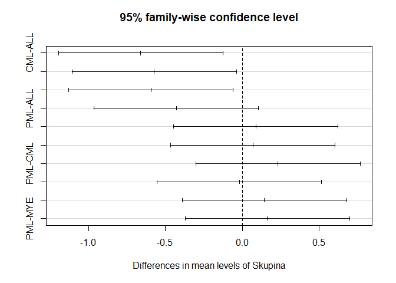

Semestrální práce
================
Karolína Šustrová, Kruh 446
2026-03-06

## 1. Rekapitulace zadání

Cílem této analýzy je porovnat míru exprese genu PPP6R3 v pěti různých
tkáňových kulturách (akutní lymfoblastická leukémie - ALL,
promyelocytická leukémie - PML, myelom - MYE, lymfom - LYM, chronická
myeloidní leukémie - CML). Data představují logaritmus signálu z DNA
čipu, jehož hodnota je úměrná logaritmu koncentrace mRNA.

## 2. Formulace hypotéz

Pro statistické ověření rozdílů použijeme analýzu rozptylu (ANOVA).

- **Nulová hypotéza ($H_0$):** Střední hodnoty exprese genu jsou ve
  všech pěti tkáňových kulturách (skupinách) shodné:
  $$\mu_{ALL} = \mu_{PML} = \mu_{MYE} = \mu_{LYM} = \mu_{CML}$$
- **Alternativní hypotéza ($H_1$):** Alespoň jedna dvojice tkáňových
  kultur (skupin) se ve střední hodnotě liší (ne všechny průměry jsou
  stejné).

Hladinu významnosti stanovujeme na $\alpha = 0.05$.

## 3. Příprava dat

Data ze zadání převedeme do formátu “long” pro analýzu v R (jeden
sloupec pro skupiny tkání, jeden pro hodnoty exprese).

``` r
# Vytvoření vektoru hodnot
hodnoty <- c(9.49401, 9.41961, 9.61037,  # ALL
             9.06951, 8.86489, 9.29840,  # PML
             8.74419, 8.76003, 9.23804,  # MYE
             8.72770, 8.90253, 9.17150,  # LYM
             8.71512, 8.91498, 8.90757)  # CML

# Vytvoření vektoru skupin
skupiny <- factor(rep(c("ALL", "PML", "MYE", "LYM", "CML"), each = 3))

# Vytvoření dataframu
df <- data.frame(Skupina = skupiny, Exprese = hodnoty)

# Kontrola dat
head(df)
```

    ##   Skupina Exprese
    ## 1     ALL 9.49401
    ## 2     ALL 9.41961
    ## 3     ALL 9.61037
    ## 4     PML 9.06951
    ## 5     PML 8.86489
    ## 6     PML 9.29840

``` r
summary(df)
```

    ##  Skupina    Exprese     
    ##  ALL:3   Min.   :8.715  
    ##  CML:3   1st Qu.:8.812  
    ##  LYM:3   Median :8.915  
    ##  MYE:3   Mean   :9.056  
    ##  PML:3   3rd Qu.:9.268  
    ##          Max.   :9.610

## 4. Vizualizace dat

Před provedením analýzy pomocí ANOVA je vhodné vizualizovat rozdělení
dat pomocí boxplotu. Vzhledem k malému počtu pozorování ($n=3$ pro
každou skupinu) přidáme i body jednotlivých měření.

``` r
ggplot(df, aes(x = Skupina, y = Exprese, fill = Skupina)) +
  geom_boxplot(alpha = 0.3) +
  geom_jitter(width = 0.1, size = 2) +
  labs(title = "Exprese genu PPP6R3 v různých tkáňových kulturách",
       x = "Tkáňová kultura",
       y = "Logaritmus exprese") +
  theme_minimal()
```


*Z grafu je patrné, že skupina ALL má vyšší hodnoty exprese než ostatní
skupiny. Naopak MYE a CML se zdají být nižší.*

## 5. Ověření předpokladů ANOVA

Pro použití ANOVA je třeba ověřit její předpoklady:

1.  **Nezávislost pozorování:** Zaručena designem studie (různé tkáňové
    kultury).

2.  **Normalita dat (residuí):** Ověříme pomocí Shapiro-Wilkova testu na
    residuích modelu.

3.  **Homogenita rozptylů (shoda rozptylů):** Ověříme pomocí Bartlettova
    testu (vhodný pro normální data).

``` r
# Vytvoření lineárního modelu pro ANOVA
model <- aov(Exprese ~ Skupina, data = df)

# 1. Test normality residuí (Shapiro-Wilk)
shapiro <- shapiro.test(residuals(model))
print(shapiro)
```

    ## 
    ##  Shapiro-Wilk normality test
    ## 
    ## data:  residuals(model)
    ## W = 0.94027, p-value = 0.3858

``` r
# 2. Test homogenity rozptylů (Bartlett)
bartlett <- bartlett.test(Exprese ~ Skupina, data = df)
print(bartlett)
```

    ## 
    ##  Bartlett test of homogeneity of variances
    ## 
    ## data:  Exprese by Skupina
    ## Bartlett's K-squared = 2.4755, df = 4, p-value = 0.649

**Interpretace ověření předpokladů:**

- **Normalita:** $p\text{-hodnota}$ Shapiro-Wilkova testu je 0.386.
  Hodnota je větší než $0.05$, proto nezamítáme nulovou hypotézu o
  normalitě. Předpoklad normality je splněn.

- **Homogenita:** $p\text{-hodnota}$ Bartlettova testu je 0.649. Hodnota
  je větší než $0.05$, proto nezamítáme nulovou hypotézu o shodě
  rozptylů. Předpoklad homogenity je splněn.

## 6. Provedení ANOVA

Nyní můžeme provést parametrickou jednofaktorovou analýzu rozptylu
(One-way ANOVA) pro testování našich hypotéz.

``` r
summary(model)
```

    ##             Df Sum Sq Mean Sq F value Pr(>F)  
    ## Skupina      4 0.8519 0.21297   5.382 0.0142 *
    ## Residuals   10 0.3957 0.03957                 
    ## ---
    ## Signif. codes:  0 '***' 0.001 '**' 0.01 '*' 0.05 '.' 0.1 ' ' 1

## 7. Post-hoc test

ANOVA ukázala statisticky významné rozdíly mezi skupinami. Musíme určit,
které konkrétní skupiny se liší. K tomu použijeme Tukeyův HSD test.

``` r
TukeyHSD(model)
```

    ##   Tukey multiple comparisons of means
    ##     95% family-wise confidence level
    ## 
    ## Fit: aov(formula = Exprese ~ Skupina, data = df)
    ## 
    ## $Skupina
    ##                diff        lwr         upr     p adj
    ## CML-ALL -0.66210667 -1.1966624 -0.12755091 0.0148720
    ## LYM-ALL -0.57408667 -1.1086424 -0.03953091 0.0342639
    ## MYE-ALL -0.59391000 -1.1284658 -0.05935424 0.0283574
    ## PML-ALL -0.43039667 -0.9649524  0.10415909 0.1334229
    ## LYM-CML  0.08802000 -0.4465358  0.62257576 0.9805360
    ## MYE-CML  0.06819667 -0.4663591  0.60275243 0.9924545
    ## PML-CML  0.23171000 -0.3028458  0.76626576 0.6260904
    ## MYE-LYM -0.01982333 -0.5543791  0.51473243 0.9999403
    ## PML-LYM  0.14369000 -0.3908658  0.67824576 0.8962386
    ## PML-MYE  0.16351333 -0.3710424  0.69806909 0.8466818

``` r
plot(TukeyHSD(model))
```

<!-- -->

## 8. Závěr

Cílem této semestrální práce bylo porovnat míru exprese genu PPP6R3 v
pěti různých tkáňových kulturách pomocí analýzy rozptylu (ANOVA).

Z výsledků jsme zjistili, že **existuje statisticky významný rozdíl** v
expresi tohoto genu mezi zkoumanými skupinami (\$F(4, 10) = 5.382,
$p = 0.0142$).

Následná Post-hoc analýza pomocí Tukeyova HSD testu odhalila, že
statisticky významný rozdíl (na hladině $p < 0.05$) je konkrétně mezi
skupinami:

- **ALL a CML** ($p = 0.015$)
- **ALL a LYM** ($p = 0.034$)
- **ALL a MYE** ($p = 0.028$)

Skupina ALL vykazuje vyšší míru exprese genu PPP6R3 než skupiny CML, LYM
a MYE. Ostatní rozdíly mezi skupinami nebyly statisticky významné.
